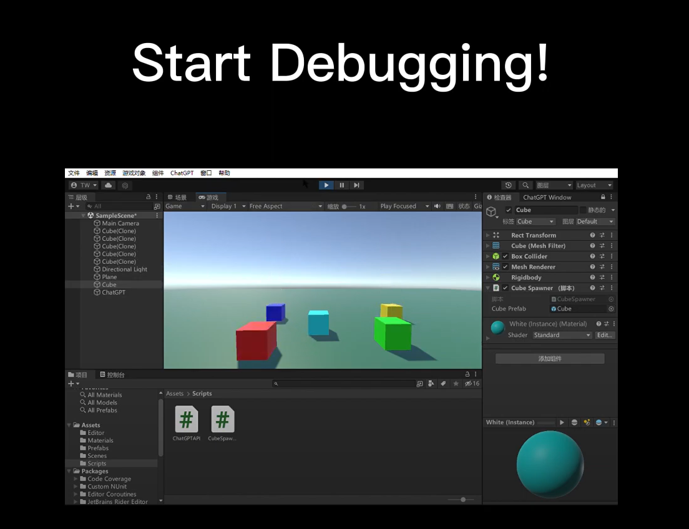

# ChatGPT-Window

## Introduction

Want to use ChatGPT-3 in Unity for code generation?

**ChatGPT-Window** brings the power of GPT-3.5 directly into your Unity development environment. This plugin allows you to generate game code quickly, boosting productivity and simplifying development tasks by providing code suggestions, snippets, and assistance right within Unity.

[Watch the ChatGPT-Window Demo Video:](#)

- [Demo on Bilibili](https://www.bilibili.com/video/BV1NG4y1P7cw)
- [Demo on YouTube](https://youtu.be/ujZsgoxOVcY)
